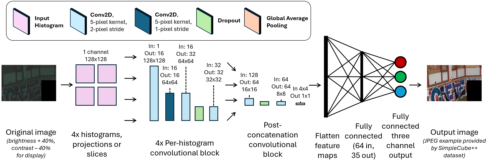

# Exploring Histogram-based Color Constancy

The goal of this repository is to provide the core code associated with the paper "Exploring Histogram-based Color Constancy" that appears in the BMVC 2025.

If you would like to read our paper, It is provided in this repository directory (along with the poster we presented and a short video overview), or you may find it on the official BMVC proceedings page: [BMVC 2025 paper link](https://bmva-archive.org.uk/bmvc/2025/assets/papers/Paper_404/paper.pdf)

## <ins>General Repository Structure</ins>
### File structure

Below is the general file structure of the project, with relevant files that are meant to be run. Files that serve as utility and are called by core files - not by the end user - are not included here for simplicity.

```
Exploring-Histogram-based-Color_Constancy-LHCC
└── constancy_model\
    └── data_classes\
        ├── data_paths.json
    └── evaluation_code\
        ├── evaluate_gray_world.py
        ├── simplecube_image_correction_from_estimate.py
        ├── test_set_evaluation.py
    ├── train_from_start.py
    ├── load_and_train.py
    ├── learning_tuning.py
    ├── learning_tuning_from_pretrained.py
    ├── simplecube_validation_split.py

└── example_parameters\
    └── gehler_shi_reprocessed\
        ├── parameters_simplecube_log.json
    └── nus8\
    	└── \canon1ds_MkIII\
            ├── parameters_nus_canon1ds_log.json
    └── SimpleCube++\
        ├── parameters_simplecube_linear.json
        ├── parameters_simplecube_log.json
        ├── parameters_simplecube_log_slices.json
    └── tune_learning\
        ├── learning_tuning_parameters.json

└── histogram_network_diagram\
    ├── LHCC_diagram.png

├── bmvc_paper.pdf
├── bmvc_poster.pdf
├── bmvc_video.mp4
```

## <ins>Datasets</ins>
In order to run this code, data must be available locally. Follow the instructions below to download and prepare the data.
Classes exist for each dataset, so all you as the user need to do is download the data, extract it, put it in the correct structure, and update the data paths file.

***AFTER DOWNLOADING, EXTRACTING, AND PREPARING ALL DATA, PUT THE CORRECT DATA PATHS INTO THE "constancy_model/data_classes/data_paths.json" file.***

### Gehler-Shi Reprocessed

Images available at: https://www.cs.sfu.ca/~colour/data/shi_gehler/

Cross folds available from FFCC: [FFCC cross folds for Gehler-Shi](https://github.com/google/ffcc/blob/2fa9e1316954dbd3913630b7d597927941b4dd32/data/shi_gehler/preprocessed/GehlerShi/cvfolds.txt#L4)

Coordinates for the ColorCheckers can be found at: [ColorChecker coordinates (prepared by Matteo Rizzo)](https://github.com/matteo-rizzo/fc4-pytorch/tree/main/dataset/coordinates)

Before using, put all images into a single directory, and update the paths appropriately in the data_paths.json file.

DO NOT CHANGE IMAGE NAMES as they are helpful for differentiating between cameras.

After downloading and unzipping the data, place all images in the same directory.

### NUS-8

Data available at: https://yorkucvil.github.io/projects/public_html/illuminant/illuminant.html

Cross folds available from FFCC (look for the cvfolds.txt files): [NUS-8 data files from FFCC](https://github.com/google/ffcc/tree/master) 

Put each fold file into the appropriate camera's directory after downloading. In the data_paths.json file, use the *name* of the file (*not* the path) as it appears in each camera's directory. This means all folds files should be named the same thing in each directory.

After downloading and unzipping the data, create a directory for each camera and place all images, masks, folds,
and ground truth MAT files into each camera's directory.

The project is set up to train each camera separately. Use the name "NUS-8_<_camera_name_>" as the dataset name for each camera in the parameter file.

### SimpleCube++

Data available at: https://github.com/Visillect/CubePlusPlus?tab=readme-ov-file
    
Data will be downloaded pre-sorted into train and test sets. Just extract from .zip file. You can use our script for creating a validation set **.\constancy_model\simplecube_validation_split.py** (more details below).

Model weights for the best log RGB and linear RGB-trained SimpleCube++ models are available in this Google drive link: [model weights](https://drive.google.com/drive/folders/1yoijgbBqgqewBePntk56KXtHOOuHM_vM)

## <ins>How to Run</ins>

First, create a conda environment using the requirements.txt file included. (Or create a virtual environment using your preferred method). This method is tested and successful for Python 3.12 and 3.13:

```
conda create --name LHCC
conda activate LHCC
pip install -r requirements.txt
```

Then, please refer to the official [PyTorch page](https://pytorch.org/get-started/locally/) to install PyTorch. If you prefer, you can add "torch" and "torchvision" on the last two lines of the requirements.txt file, though this seems to default to a CPU-only version. Please also note that we have only tested this with a CUDA-enabled PyTorch version with a GPU available, so there may be issues if training/evaluating on a CPU-only.

To run each of the scripts, use something like below (replace *\<script_name\>* and *\<param_x\>* with actual script name parameters). Make sure to run this from the overall **./Exploring-Histogram-based-Color-Constancy-LHCC** repo, not the **./constancy**model repo.

```
python -m constancy_model.<script_name> <param_1> <param_2> ...
```

For example:
```
python -m constancy_model.train_from_start path_to_param_file path_to_output_dir
```

The primary script to train the network is in **.\constancy_model\train_from_start.py**

For Gehler-Shi and NUS-8, it is recommended to use **.\constancy_model\load_and_train.py** with a pre-trained SimpleCube++ model to obtain the best results (this is what we did in the paper). SimpleCube++ is much larger than Gehler-Shi and NUS-8 (the mainstream single-illuminant color constancy datasets are all very small).

To train the network: provide, as command line arguments, the path to the .json parameters file (example parameters are included in the folder structure above for each dataset. These are not comprehensive for all datasets, cameras, color spaces, etc. but should serve as a foundation),
and pass the output directory for the saved network outputs (model(s) at best epochs, training curve(s), optimizer(s), text file of best epoch error values). **THE DATASET TO TRAIN WITH IS DEFINED IN THE PARAMETER FILE**, not via a command line argument. See each of the python files that are meant to be run (at the bottom of the code file) to see the exact parameters and their order that must be passed via the command line.

Since SimpleCube++ came only with a train/test split, we defined a validation set that was the same size as the test set from a randomly selected set of images in the training set. The script used to do so is included at **.\constancy_model\simplecube_validation_split.py**. **FOLLOW THE INSTRUCTIONS AT THE TOP OF THE FILE TO USE THIS SCRIPT, AS IT MOVES FILES.** The main advice is to make a copy of the train portion of the SimpleCube++ dataset in a separate directory, then run the validation splitting script on this copy.

If you want to perform learning parameter tuning, use either the **.\constancy_model\learning_tuning.py** or **.\constancy_model\learning_tuning_from_pretrained.py** script. An example of a full set of learning parameters to tune on is included.

The script **.\constancy_model\evaluation_code\test_set_evaluation.py** can be used to evaluate a pre-trained model on a specified test set.

Finally, the script **.\constancy_model\evaluation_code\simplecube_image_correction_from_estimate.py** can be used to generate a set of corrected images. It is specifically designed for use with SimpleCube++, though it could be adapted for other datasets. Before using it, also run **.\constancy_model\evaluation_code\evaluate_gray_world.py** To get gray world estimates for comparison. You could also adapt the code to ignore the gray world estimates, if you prefer.

## <ins>Parameters</ins>

### Checkpoint parameters
- **model_title**: Name for the model. This only affects the loss graph.
- **save_model_checkpoint**: After how many epochs to save the model/loss graph.

### Data parameters
- **dataset_name**: Use the constancy_model/data_classes/data_paths.json to obtain the names of various dataset names. Keep in mind the naming conventions for NUS-8 cameras described above.
- **num_buckets**: The number of histogram buckets (in a single dimension, but applies to both). For example, using '128' would lead to a 128x128 histogram.
- **histsograms_per_image**: Use **4**.
- **color_space**: This should be "LINEAR" or "LOG" depending on the desired color space.
- **histogram_saturation_method**: Method for normalizing the range of histogram bin count values. We found that "LOG" works best, but "CLIP", "TANH", and "LINEAR" (none) are also available.
- **clip_upper_bound**: Relevant when using the "CLIP" histogram saturation method. Tested with values 255 and 1023.
- **projection_type**: "STATIC" leads to the 2D projections of 3D histograms, while "SLICES" leads to the slices of histograms.
- **num_folds**: This corresponds to the number of folds to train for a dataset. When training, it is possible to train all three folds at the same time by setting this to 3, or to train a single fold by setting this to 1 (SimpleCube++ should always use 1).
- **image_scale_factor**: What scale to use for the image. We found that downscaling slightly using a factor of 0.75 worked best.

### Threshold parameters
- **blue_threshold_8bit**: Lower bound (in 8-bit range) for blue values counted in histograms. Scales up to 16-bits when using images > 8-bit.
- **green_threshold_8bit**: Lower bound (in 8-bit range) for green values counted in histograms. Scales up to 16-bits when using images > 8-bit.
- **red_threshold_8bit**: Lower bound (in 8-bit range) for red values counted in histograms. Scales up to 16-bits when using images > 8-bit.


### Model parameters
While there are many parameters in this section, they were put into the parameter files to facilitate tuning the network more easily. Please do not change these values, as they correspond directly to the proper network structure.



### Learning parameters

Note that the learning parameters may require additional tuning per model/dataset/camera. We tuned learning rate and batch size for each model, and ran a more comprehensive search for SimpleCube++.


- **scheduler**: Use "none" or "cosine_annealing".
- **optimizer**: We used "adam", but other optimizers (SGD) may work as well.
- **learning_rate**: Default is 0.0001 for SimpleCube++.
- **momentum**: Relevant if using SGD, but not Adam.
- **epochs**: All of our experiments defaulted to a full training run of 200 epochs.
- **batch_size**: Default for SimpleCube++ is 16.
- **random_state**: All of our experiments used a random state of 42.
- **loss_function**: "angular" (angular error) or "euclidean" (Euclidean distance) loss functions. We used angular error in our experiments.

## <ins>General Notes</ins>

If you encounter any issues - big or small - please feel free to submit an issue on this GitHub page or create a PR. We will do our best to resolve them or answer any questions in a timely manner.

A few suggested improvements or next steps, if you would like to contribute:

1. Better command line argument handling with an argument parser
2. Update from JSON to YAML files
3. Simplifying the network structure/parameter pairing (e.g. a more hard-coded model structure to trim the parameter files)


## <ins>Citation</ins>
```
@inproceedings{IV_2025_BMVC,
author    = {David R. Treadwell IV and Yunxuan Rao and Daniel Y. Bi and Bruce A. Maxwell},
title     = {Exploring Histogram-based Color Constancy},
booktitle = {36th British Machine Vision Conference 2025, {BMVC} 2025, Sheffield, UK, November 24-27, 2025},
publisher = {BMVA},
year      = {2025},
url       = {https://bmva-archive.org.uk/bmvc/2025/assets/papers/Paper_404/paper.pdf}
}
```